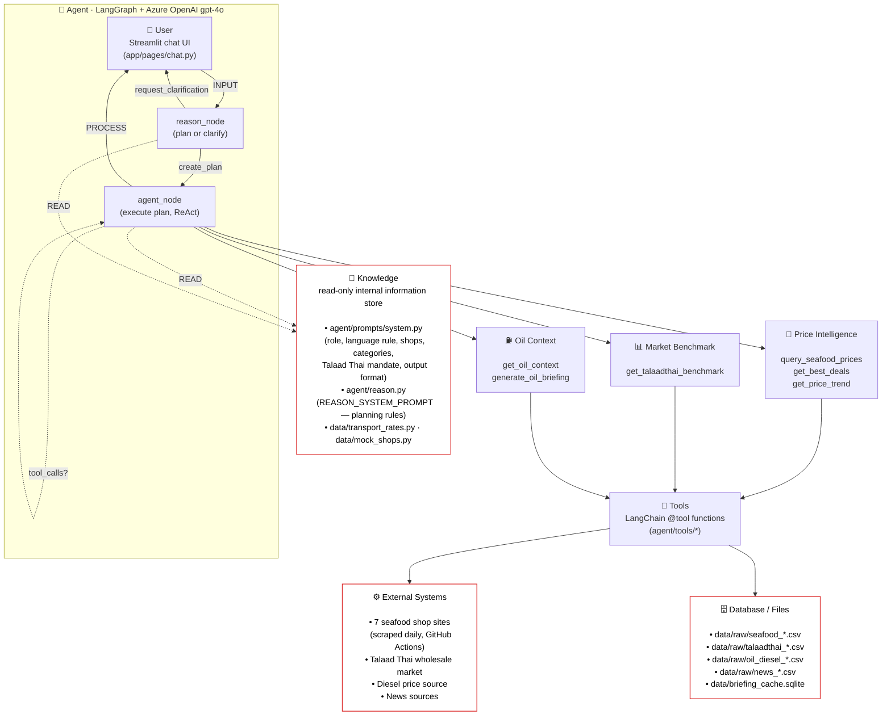

# Agent Architecture

## Overview

The Bangkok Seafood Price Advisor uses a **LangGraph ReAct agent** running on **Azure OpenAI `gpt-4o`** with a two-stage graph: a `reason_node` that either asks one clarifying question or commits to an execution plan, then an `agent_node` that calls tools in a ReAct loop until it has enough data to answer. The agent is bilingual — it mirrors the user's language (Thai or English) on every reply, including clarifying questions.

## Agent Design



### How the diagram maps to the example "Agent Design" template

| Example block | This system |
|---|---|
| **User** (INPUT) | Streamlit chat (`app/pages/chat.py`); a Thai/English user prompt enters via `_invoke_agent()` |
| **Basic Agent** (PROCESS) | LangGraph `build_graph()` with `reason_node` + `agent_node` (Azure OpenAI `gpt-4o`, temperature 0) |
| **Knowledge** (read-only internal info store) | System prompts + static configs — `agent/prompts/system.py`, `agent/reason.py`, `data/transport_rates.py`, `data/mock_shops.py` |
| **TOPIC** boxes (sub-flows) | Three intent groupings: **Price Intelligence**, **Market Benchmark**, **Oil Context** — each backed by 1–3 tools |
| **TOOL** | LangChain `@tool` functions in `agent/tools/` (one LangGraph `ToolNode`) |
| **External Systems** | Daily scrapes from 7 seafood shop websites, Talaad Thai market, diesel price source, news sources |
| **Database** | Scraped CSVs in `data/raw/` + the briefing LLM-cache SQLite (`data/briefing_cache.sqlite`) |

## Components

### LLM Core

- **Provider:** Azure OpenAI (`AzureChatOpenAI` via LangChain)
- **Model:** `gpt-4o` (deployment configurable via `AZURE_DEPLOYMENT`)
- **Temperature:** `0` — deterministic tool selection for reproducible demos
- **Tool binding:** the chat LLM is bound with all 6 public tools via `.bind_tools()`
- **Two LLM calls per turn:** one in `reason_node` (bound to internal `request_clarification` / `create_plan`), one in `agent_node` (bound to public tools); both share the same factory in `agent/llm.py`

### Two-Stage Graph

1. **`reason_node`** (`agent/reason.py`) — runs first on every turn. Reads the conversation, then calls exactly one of:
   - `request_clarification(question, options)` — pauses the graph and surfaces clickable buttons in the UI when the request is genuinely ambiguous (no item *and* no clear intent)
   - `create_plan(steps)` — produces an ordered list of tool calls to execute

   The reason layer also enforces the language-mirroring rule: clarifying questions and option labels are emitted in the user's language.

2. **`agent_node`** (`agent/main.py`) — receives the plan, then enters a ReAct loop: call planned tools, observe results, optionally call more tools, finally synthesize a bilingual reply with product links and an order table.

### Tools (the public surface)

| Tool | Topic | Purpose |
|---|---|---|
| `query_seafood_prices(item, shop?)` | Price Intelligence | Look up an item across shops; optional shop filter |
| `get_best_deals(category?)` | Price Intelligence | Items >10% below cross-shop average |
| `get_price_trend(item, days=7)` | Price Intelligence | Date×shop price history or current spread |
| `get_talaadthai_benchmark(species)` | Market Benchmark | Wholesale reference price (ราคากลาง) — auto-attached to every price answer |
| `get_oil_context(species?)` | Oil Context | Diesel price + correlation with seafood |
| `generate_oil_briefing(period, language)` | Oil Context | Markdown briefing, cached in SQLite |

All tools are decorated with LangChain `@tool` for auto-schema generation. Search is bilingual (English name, Thai name `group_th`, category, website item name).

### State

```python
class AgentState(TypedDict):
    messages: Annotated[list, add_messages]
    pending_clarification: Optional[dict]   # {question, options}
    current_plan: Optional[list]            # list[str] from reason_node
    last_thinking: Optional[str]            # one-sentence rationale
```

The full message history is preserved across turns. The clarifying question is persisted as an `AIMessage` so the user's button click is interpreted as an answer, not a new ambiguous query (fix from PR #14).

### Data Pipeline

```
Registry CSV (Google Sheet export)         Daily Scraper (GitHub Actions)
  เอเจ้นหาปลา - working sheet.csv           data/scripts/scraper.py
  ~229 products from 7 shops                 Runs 8am BKK daily
           │                                          │
           │ fallback for failed sources              │ appends timestamped rows
           ▼                                          ▼
                        data/loader.py
                   (unified data layer)
                            │
              ┌─────────────┼─────────────┐
              ▼             ▼             ▼
         agent/tools   dashboard.py  shop_profile.py
```

Other loaders:
- `data/oil_loader.py` → diesel CSV
- `data/oil_correlation.py` → species × oil correlation
- `agent/tools/talaadthai_benchmark.py` → wholesale CSV lookup
- `agent/tools/oil_briefing.py` → SQLite cache + LLM summarization

**Seafood schema:** `scrape_date | source | item_name_website | group_en | group_th | option | weight_kg | selling_price | price_per_kg | link`

### Observability

- **Langfuse `CallbackHandler`** auto-traces every LLM call, tool invocation, and token usage. Falls back gracefully if `LANGFUSE_*` credentials are not set.
- **Streamlit tool panel** — each assistant reply has an expandable section showing every tool call, arguments, and raw result. The clarifying question (if any) and the plan are surfaced in their own expanders for demo transparency.

### User Interface (Streamlit)

| Page | File | Description |
|---|---|---|
| Chat | `app/pages/chat.py` | ReAct agent chat with bilingual examples; renders clarification buttons and tool/plan/reasoning expanders |
| Price Dashboard | `app/pages/dashboard.py` | Category filter, decision card, comparison charts, shop pivot table |
| Shop Profiles | `app/pages/shop_profile.py` | Per-shop KPIs, price positioning, full catalog |

All pages are protected by a shared password gate (`app/auth.py`). Product links in chat answers and dashboard tables are clickable.
